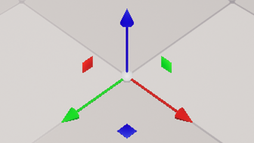
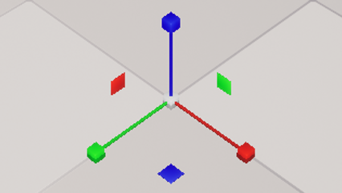
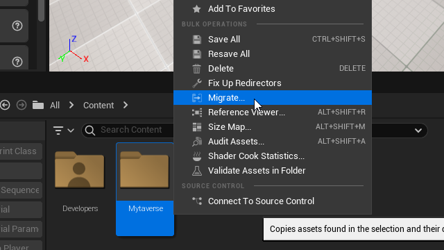
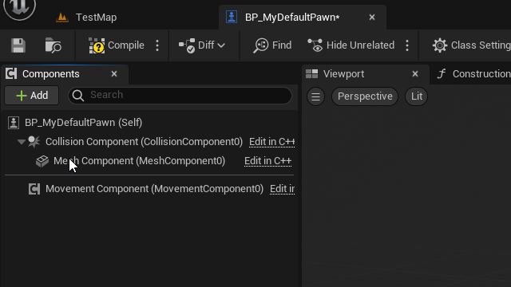
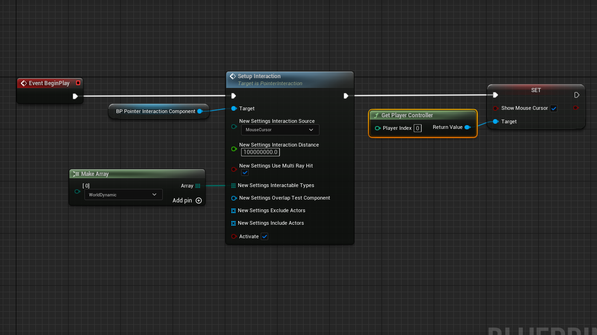
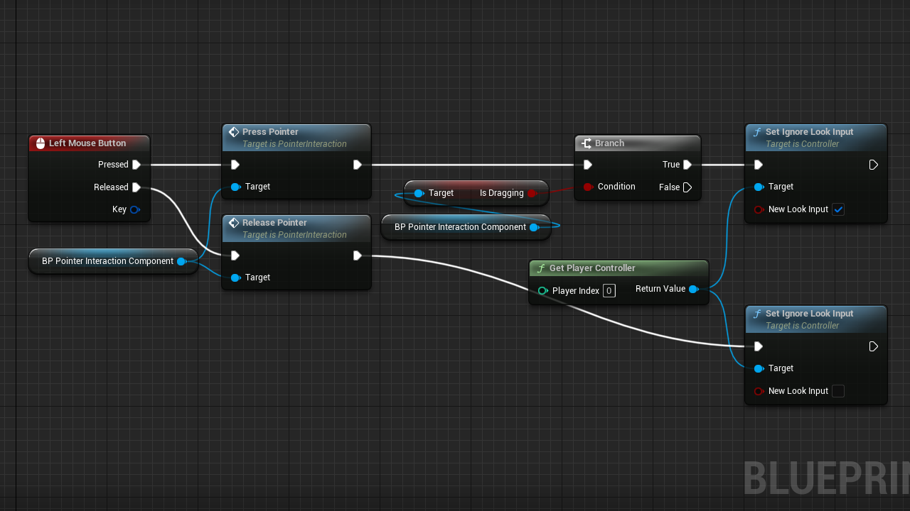
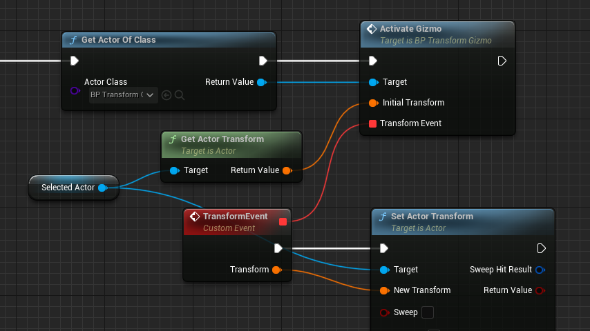
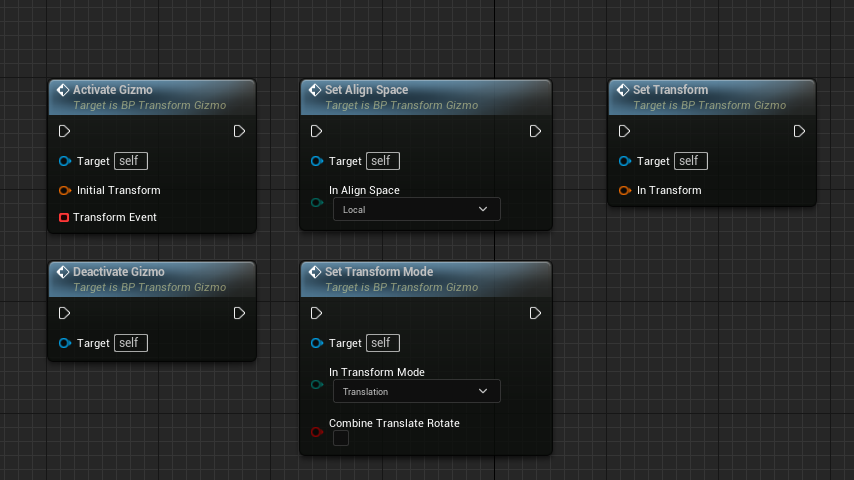
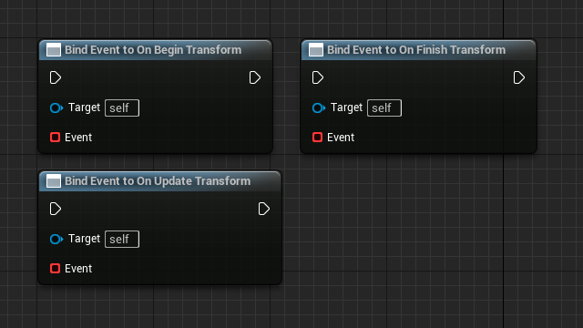

# UE5RuntimeTransformGizmo

## Preview
A Simple tool to transform object at runtime game  
Made a prototype for touch device support  
  
  
  
  

## Basic Usage
1. Open this project and right click the "Mytaverse" folder in the content browser, select to migrate to your project's content  
  

2. Open the Pawn(or Character) Blueprint used by your project (You can only use it in blueprints since it's a pure blueprint feature), and then add a component called "Pointer Interaction"  

3. Call the SetupInteraction function of the PointerInteraction at the BeginPlay event, and then SetShowMouseCursor to true to show the mouse cursor  

    - InteractionSource: Set it to MouseCursor to enable mouse cursor interaction
    - InteractionDistance: The max distance that the mouse cursor ray can reach, just set this to a large number
    - UseMultiRayHit: Must set this to true
    - InteractionTypes: Type of objects that can be interact with, gizmo is WorldDynamic
    - Activate: Set this to true to finally enable the interaction

4. In your pawn blueprint, add the LeftMouseButton event call the PressPointer and ReleasePointer function of the PointerInteraction component

    - When you click on the gizmo it will enter the Dragging state, during the dragging state you better not change the camera position or rotation. So I will call the SetIgnoreLookInput to disable the view control if the PointerInteraction component is under the dragging state. Call it again to enable view control after release the mouse  

5. When you want to enable the gizmo, you can just call the ActiveGizmo function of the BP_TransformGizmo object. By the way you should place or spawn a BP_TransformGizmo object before that.  
  
    - InitialTransform: it means the gizmo's initial transform, usually when you want to enable gizmo on an actor, you should pass it's transform to the gizmo's initial transform
    - TransformEvent: it binds the event which will be called when dragging the gizmo
    - Currently the gizmo blueprint only takes in a initial transform value and then we drag it to compute the world transform value, it doesn't modify the object transform directly. But we can get the world transform value from a event dispatcher called "OnUpdateTransform". Then you can do whatever you want with this transform value

## Functions List
  
  
  

## Other Useful Info
- UE5 already has this feature build in, you can use it in runtime build. Check the codes in the
[InteractiveToolsFramework](https://github.com/EpicGames/UnrealEngine/tree/release/Engine/Source/Runtime/InteractiveToolsFramework) module  
  
[Ref Article1](https://www.gradientspace.com/tutorials/2022/6/1/the-interactive-tools-framework-in-ue5)  
[Ref Article2](https://www.gradientspace.com/tutorials/2021/01/19/the-interactive-tools-framework-in-ue426)
- And check out the brand new [ScriptableToolsFramework](https://github.com/EpicGames/UnrealEngine/tree/407acc04a93f09ecb42c07c98b74fd00cc967100/Engine/Plugins/Experimental/ScriptableToolsFramework/Source/ScriptableToolsFramework) module in the UE5.2 which is greate!

